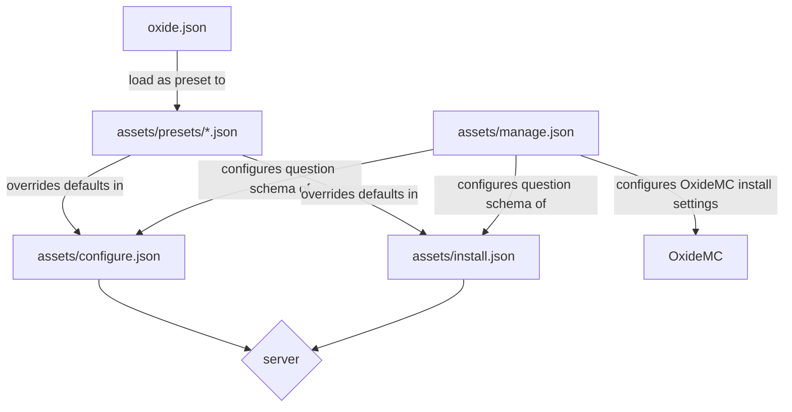

# OxideMC Structure

## Workspace Crates

```text
oxidemc/
├── crates/
│   ├── oxidemc-core/    # server logic, config parsing, JAR downloads, mod management
│   ├── oxidemc-tui/     # ratatui terminal UI (binary: oxidemc)
│   └── oxidemc-webui/   # web UI (binary: oxidemc-web)
├── assets/              # question schema files shipped with the binary
└── docs/
```

`oxidemc-tui` and `oxidemc-webui` both depend on `oxidemc-core`. No UI code lives in core.

---

## Assets (question schema files)

Shipped with OxideMC. Define what questions are shown and their default values.

```text
assets/
├── manage.json          # questions for configuring OxideMC itself and the other schemas
├── install.json         # questions shown when setting up a new server
├── configure.json       # questions shown when configuring a server
└── presets/             # named presets that override question defaults
    └── example.json
```

---

## Per-server files

Each server OxideMC manages gets one file in its directory:

```text
<server-directory>/
├── oxide.json           # saved state — answers to all install/configure questions
└── <server.jar>
```

`oxide.json` captures the full state of a server setup. Loading it as a preset lets you duplicate that server exactly.

---

## Configuration Flow


