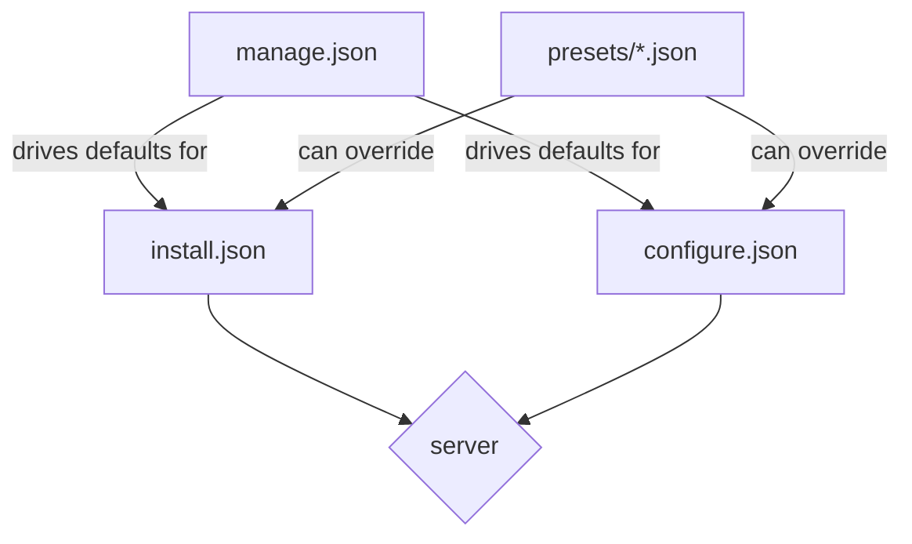

# OxideMC Structure

## Workspace Crates

```text
oxidemc/
├── crates/
│   ├── oxidemc-core/    # server logic, config parsing, JAR downloads, mod management
│   ├── oxidemc-tui/     # ratatui terminal UI (binary: oxidemc)
│   └── oxidemc-webui/   # web UI (binary: oxidemc-web)
└── docs/
```

`oxidemc-tui` and `oxidemc-webui` both depend on `oxidemc-core`. No UI code lives in core.

---

## Application File Layout

Files OxideMC reads/writes at runtime, relative to the user's config directory:

```text
~/.config/oxidemc/
├── manage.json          # global settings — controls question flow and defaults
└── presets/             # user-defined presets, each is a .json file
    ├── paper-latest.json
    └── vanilla-survival.json
```

Per-server config files (`install.json`, `configure.json`) are generated in each server's directory:

```text
<server-directory>/
├── install.json         # how the server was installed (type, version, path)
├── configure.json       # server configuration (port, RAM, JVM flags)
└── <server.jar>
```

---

## Configuration Structure

`manage.json` is the top-level config. It determines which fields appear in `install.json` and `configure.json` and what their defaults are. Presets are separate files that can override `manage.json` values for a specific setup.



---

## Config Reference

See [config.md](config.md) for all fields.
